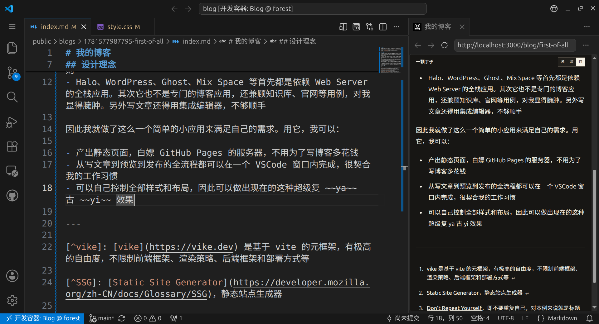
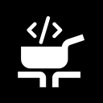

# 符合 DRY 和 DIP 的博客渲染器 <:\_>

此文旨在测试博客的 md 渲染能力和内容页功能，也顺便介绍一下我的小博客。

本站点由 vike[^vike] 驱动，以 SSG[^SSG] 模式在构建阶段完成渲染并部署在 [GitHub Pages](https://github.com/YKDZ/blog/deployments/github-pages) 上。

## 背景

博客最终还是以内容为中心的，因此我觉得码字体验是高于一切的。我曾尝试过 WordPress、Halo、VitePress、Ghost、Mix Space 等各种形态的博客应用。但这些通用产品都有令我不满的地方，例如：

- VitePress 虽然是 SSG，但是毕竟还是为产品文档一类需求设计的，写文章还要考虑 Sidebar 位置，不能做到在一个 `.md` 中就完成全部工作。另外文档标题、正文标题、`Sidebar Item` 标题又都是分开定义的，很烦人
- Halo、WordPress、Ghost、Mix Space 等首先都是依赖 Web Server 的全栈应用。其次它也不是专门的博客应用，还兼顾知识库、官网等用例，且为了追赶潮流而大都有各种 AI 功能，对我就显得臃肿。另外写文章还得用 Web 编辑器，不够顺手

因此我就做了这么一个简单的小应用来满足自己的需求。用它，我可以：

- 直接编辑 markdown 文件，不用为了写个博客去花时间适应那些所见即所得编辑器，且不用引入任何 MCP 就可以适配任何 Agent CLI
- 产出静态页面，白嫖 GitHub Pages 的服务器，不用为了写博客多花钱
- 文章直接以文件形式储存在 GitHub 上，安全可靠
- 从写文章到预览到发布的全流程都可以在一个 VSCode 窗口内完成，很契合我的工作习惯
  
- 可以自己控制全部样式和布局，因此可以做出现在的这种超级复 ~~ya~~ 古 ~~yi~~ 效果
- 可以自由扩展我喜欢的阅读器功能，比如 [hover 预览](./index.md#icon)

## 设计理念

### DRY 和 DIP

> 在一个系统中，每一处知识都必须单一、明确、权威地表达。  
> 《The Pragmatic Programmer》

> A. 高层次的模块不应该依赖于低层次的模块，两者都应该依赖于抽象接口。  
> B. 抽象接口不应该依赖于具体实现。而具体实现则应该依赖于抽象接口。  
> 《Agile Software Development: Principles, Patterns, and Practices》

博客系统天然需要 `Blog(title, description, content)` 这样的实体，但传统的分开定义的方式难免有以下问题：

- `content` 里的 `# 文章标题` 算正文还是标题？渲染和导出时要去重吗？
- 我习惯在正文的第一段概括全文内容，我为什么非得把它单独写成文档描述，与文档分离？
- 导出为 md 时标题要拼接到文档头部还是 frontmatter，描述呢？

我认为这是一种违反 DRY[^DRY] 原则的、讨厌的重复。

VitePress 等很多博客系统引入了 frontmatter 用于定义文档实体的元数据，并让用户可以引用这些数据来解决重复问题：

```markdown
---
title: 文章标题
---

# {{ $frontmatter.title }}

正文内容
```

但这就让正文只有在被 VitePress 编译后才能正确渲染，也就是违反了 DIP[^DIP]。~~而且我觉得 frontmatter 好丑~~。

为了避免上述这些问题，我的博客标题取原始 MD AST[^AST] 中第一个 `heading`，而描述则取标题后的第一个 `paragraph`。得益于此，我不用反复书写相同的标题和描述（DRY），也不用为了编译和渲染器需要的实体结构来改变我的 md 文档结构，而是让 `文档 -> 解析器` 反转为 `文档 -> MD AST <- 解析器` —— 典型的 DIP。

### 易用性

写文章本来就很费心了，我不想再给自己加任务。目前我的工作流是：

```bash
# 创建文档模板
pnpm write second
/workspaces/blog/public/blogs/1781614950277-second/index.md
# 启动开发服务器
pnpm dev
```

这样就可以在侧边栏实时预览渲染效果，并在 VSCode 中编辑文档。

写完后就直接通过 VSCode 的源代码管理 UI 进行提交和推送即可，GitHub Action 会自动触发并完成测试、构建和发布到 Pages 的工作。

这种两条命令就可以开始写文章的复杂度对我来说是可以接受的，多几个步骤换来的是与编码心智模型相同的码字体验。

站点还仅在 SSG 期间自动生成 sitemap.xml、robots.txt、llms.txt、atom.xml 等辅助检索、阅读的静态文件，同时将部分图片转换为 webp 以降低网络压力。所有这些功能对码字过程都是透明的。

### 文档优先

我用 vite 原生支持的 Static Assets 机制在 `public/blogs/` 目录下管理所有文档。`pnpm write <slug>` 命令会帮我创建以下格式的博客模板：

```
<timestamp-slug>
├── assets/
└── index.md
```

在写文章时，我不用考虑图片等静态文件的放置位置，可以自由地用 `public/a/b/c.png`、`./assets/a.png`、`../xxx/assets/b.png`、`../xxx/index.md#title` 等各种方式引用 `public` 目录中的静态资源和其他文章等。在渲染时，一个 `remark` 插件会完成目录的映射工作，将对文档的引用解析为 `/blog/slug/#hash` 的形式，而将其他静态资源解析为相对于 `/` 的 url 形式，以便直接利用 Static Assets 机制引用打包好的静态资源。

同时，文章的创建时间也自然地被通过目录名中的 unix timestamp 维护起来，且可以实现文章自然地按时间顺序在目录下排序。

最后，`index.md` 和存储它的目录基本上完整描述了一篇博客的的所有数据，无需额外的配置文就可以定义一个 `Blog` 实体，这种文档优先的做法也进一步降低了码字难度。

当然我还没有引入文档 tags，也主要是 tags 很难像 title 和 description 一样从 AST 中被提取。这里就只能依赖后人的智慧了。

## Icon

本站的 favicon 是这个：



原图来自 [Yesicon](https://yesicon.app/hugeicons/cook-book)（MIT 协议），自行修改为黑色背景和白色线条。

这是一本食谱书，寓意软件工程犹如烹饪，是纯粹的创造。因此这个博客除了技术内容之外应该也会整理一些原创食谱。

---

[^vike]: [vike](https://vike.dev) 是基于 vite 的元框架，有极高的自由度，不限制前端框架、渲染策略、后端框架和部署方式等

[^SSG]: [Static Site Generator](https://developer.mozilla.org/zh-CN/docs/Glossary/SSG)，静态站点生成器

[^DRY]: [Don't Repeat Yourself](https://en.wikipedia.org/wiki/Don%27t_repeat_yourself)，即不要重复自己，对本例来说就是标题写一次就够了

[^DIP]: [Dependence Inversion Principle](https://zh.wikipedia.org/zh-hans/%E4%BE%9D%E8%B5%96%E5%8F%8D%E8%BD%AC%E5%8E%9F%E5%88%99)，即依赖倒置原则，对本例来说就是高层文档内容与 vue 风格的模板语法强耦合

[^AST]: [Abstract Syntax Tree](https://zh.wikipedia.org/wiki/%E6%8A%BD%E8%B1%A1%E8%AA%9E%E6%B3%95%E6%A8%B9)，即抽象语法树，博客使用的解析器是 [mdast](https://github.com/syntax-tree/mdast)
